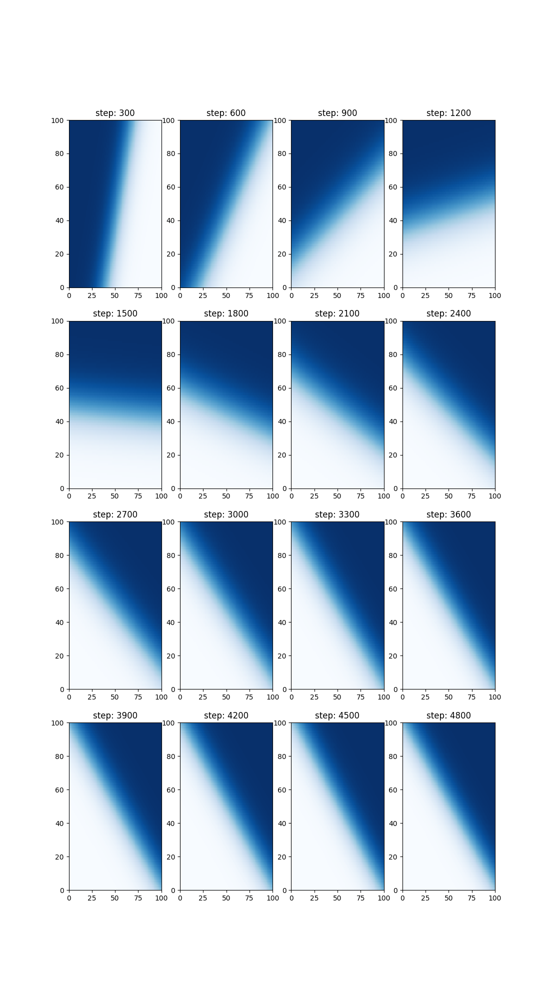
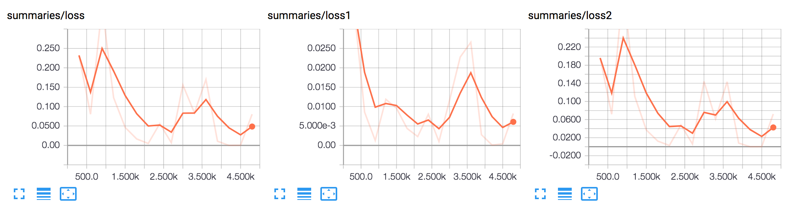

# multi-instance learning


A reference implementation of multi-instance learning. In this case the hypothesis space is linear boundaries and the 
group labels are fraction of the corresponding training subset in the positive class.


## Background

Based on the paper: 
http://mdenil.com/media/papers/2015-deep-multi-instance-learning.pdf

 idea: transfer knowledge of labels on groups (subsets of data) to learned labels on individual points. often labels on groups are present/cheap, labels on individuals are expensive/rare. Example: Suppose known voting results by neighborhood, as well as features of (but not specific voting result) of individuals. Multi-instance learning uses this information to infer voting likelihood of each individual.


The loss function consists of two terms; one a similarity term on inputs and the other a group loss term:

```

L = 1 / N^2 * K_ij * P_ij  + 1 / G * Q_kk

where
    K_ij := pairwise kernel over individual inputs    
    P_ij: pairwise loss over predicted individual outputs
    Q_ij := pairwise loss between predicted and atual group outputs
    N := number of individual training inputs (batch size)
    G := number of group training inputs (group batch size)


```


#### Learned decision boundaries at successive training iterations

#### Training loss



## Run

Execute the script to train a linear decision boundary and generate the above heatmaps.

```
$ python3 mitr.py
```

View tensorboard plots at localhost:6006

```
$ tensorboard --logdir=mitr/mitr_logs
```


